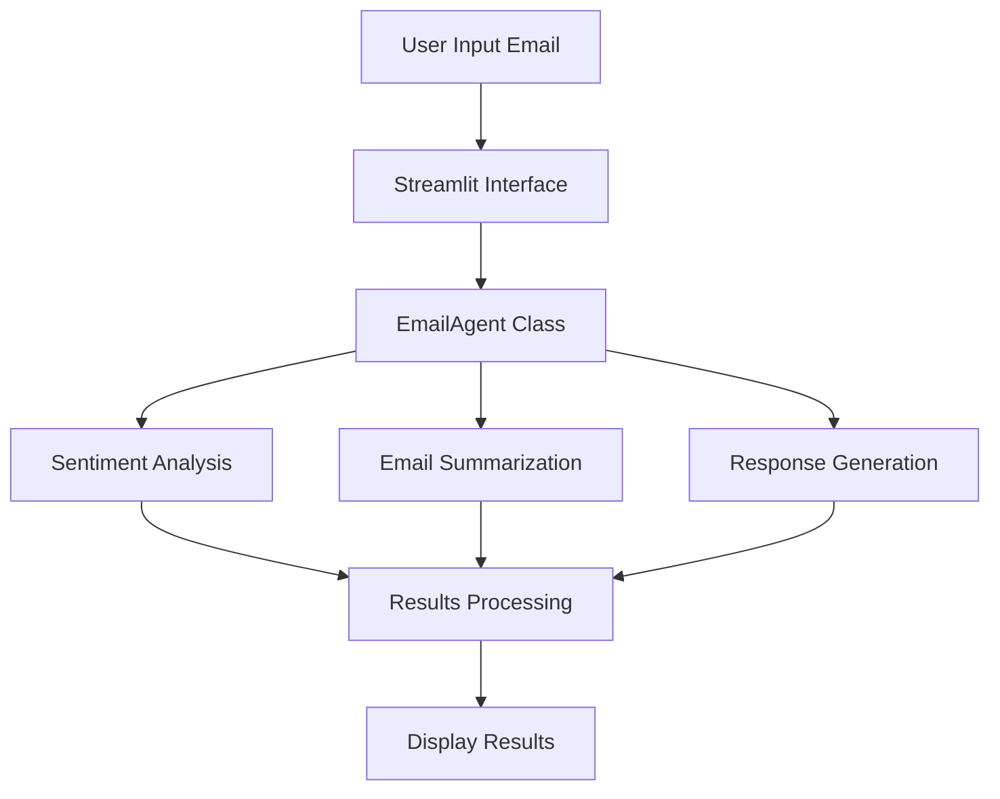

# Email Agent Architecture

## 📁 Project Structure

```
email_agent/
├── app.py                 # Streamlit web interface
├── email_agent.py         # Core email processing logic
├── requirements.txt       # Project dependencies
└── README.md             # Project documentation
```

## 🔄 Process Flow



## 🧩 Code Structure

### 1. `email_agent.py`

```python
class EmailAgent:
    def __init__(self):
        # Initialize three main NLP pipelines
        self.sentiment_analyzer = pipeline("sentiment-analysis", ...)
        self.summarizer = pipeline("summarization", ...)
        self.text_generator = pipeline("text-generation", ...)

    def analyze_email(self, email_text):
        # 1. Generate summary using BART
        summary = self.summarizer(email_text, ...)
        
        # 2. Analyze sentiment using DistilBERT
        sentiment = self.sentiment_analyzer(email_text, ...)
        
        return summary, sentiment

    def needs_response(self, sentiment, score):
        # Decision logic for response generation
        if sentiment == "NEGATIVE" or (sentiment == "POSITIVE" and score > 0.9):
            return True
        return False

    def generate_response(self, email_text, summary):
        # Generate response using GPT-2
        response = self.text_generator(summary, ...)
        return response
```

### 2. `app.py`

```python
# Streamlit UI Components
st.title("Smart Email Agent")
email_input = st.text_area("Enter email")
analyze_button = st.button("Analyze")

if analyze_button:
    # 1. Initialize EmailAgent
    agent = EmailAgent()
    
    # 2. Process email
    with st.spinner("Processing..."):
        # 2.1 Analyze email
        summary, sentiment = agent.analyze_email(email_input)
        
        # 2.2 Check if response needed
        needs_reply = agent.needs_response(sentiment)
        
        # 2.3 Generate response if needed
        if needs_reply:
            response = agent.generate_response(email_input, summary)
    
    # 3. Display results
    st.markdown("### Results")
    st.markdown(f"Summary: {summary}")
    st.markdown(f"Sentiment: {sentiment}")
    if needs_reply:
        st.markdown(f"Response: {response}")
```

## 🤖 Model Integration

### 1. Sentiment Analysis (DistilBERT)
```python
# Model: distilbert-base-uncased-finetuned-sst-2-english
sentiment_analyzer = pipeline(
    "sentiment-analysis",
    model="distilbert-base-uncased-finetuned-sst-2-english",
    device="cpu"
)
# Output: {"label": "POSITIVE/NEGATIVE", "score": 0.XX}
```

### 2. Summarization (BART)
```python
# Model: facebook/bart-large-cnn
summarizer = pipeline(
    "summarization",
    model="facebook/bart-large-cnn",
    device="cpu"
)
# Parameters:
# - max_length: 80
# - min_length: 20
# - num_beams: 4
# - length_penalty: 0.8
```

### 3. Response Generation (GPT-2)
```python
# Model: gpt2
text_generator = pipeline(
    "text-generation",
    model="gpt2",
    device="cpu"
)
# Parameters:
# - max_length: 100
# - temperature: 0.7
# - top_p: 0.9
# - repetition_penalty: 1.2
```

## 🔄 Data Flow

1. **Input Processing**
   ```python
   # User enters email text
   email_text = "Dear Team, ..."
   ```

2. **Analysis Phase**
   ```python
   # 1. Generate summary
   summary = summarizer(email_text)
   # Output: "Team member expresses concerns about project timeline..."
   
   # 2. Analyze sentiment
   sentiment = sentiment_analyzer(email_text)
   # Output: {"label": "NEGATIVE", "score": 0.85}
   ```

3. **Response Generation**
   ```python
   # If sentiment is negative or highly positive
   if needs_response(sentiment):
       response = text_generator(summary)
       # Output: "Thank you for bringing this to our attention..."
   ```

4. **Results Display**
   ```python
   # Display in Streamlit UI
   st.markdown(f"Summary: {summary}")
   st.markdown(f"Sentiment: {sentiment['label']}")
   st.markdown(f"Response: {response}")
   ```

## ⚙️ Configuration

### Model Parameters
```python
# Summarization
SUMMARY_CONFIG = {
    "max_length": 80,
    "min_length": 20,
    "num_beams": 4,
    "length_penalty": 0.8
}

# Response Generation
RESPONSE_CONFIG = {
    "max_length": 100,
    "temperature": 0.7,
    "top_p": 0.9,
    "repetition_penalty": 1.2
}
```

### UI Configuration
```python
# Streamlit UI Settings
PAGE_CONFIG = {
    "page_title": "Email Agent",
    "page_icon": "✉️",
    "layout": "wide"
}

# CSS Styling
STYLE_CONFIG = {
    "background_color": "#f0f2f6",
    "text_color": "#000000",
    "positive_color": "#00aa00",
    "negative_color": "#ff0000"
}
```

## 🔍 Error Handling

```python
try:
    # Initialize models
    agent = EmailAgent()
    
    # Process email
    results = agent.process_email(email_text)
    
except Exception as e:
    # Display error in UI
    st.error(f"Error: {str(e)}")
    
    # Log error
    print(f"Error processing email: {str(e)}")
``` 